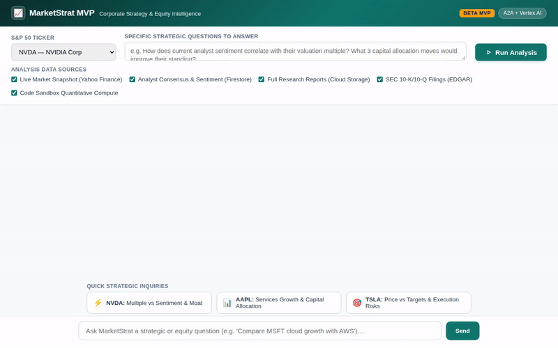

# MarketStrat MVP (Beta) — Corporate Strategy & Equity Intelligence Agent



**MarketStrat MVP** is an autonomous corporate strategy and equity intelligence agent (Beta release) built with the Google Agent Development Kit (ADK) and Gemini on Vertex AI. It conducts multi-dimensional corporate evaluations covering real-time financial fundamentals, SEC filings, indexed Wall Street analyst consensus, and strategic action plans—rendering comprehensive briefings as structured A2UI cards.

---

## What the Agent Actually Does

MarketStrat automates executive and investor analysis through orchestrated tools and Google Cloud services:

1. **Market Fundamentals & Valuation Tracking**
   - Retrieves live pricing, valuation multiples (Forward P/E, P/S, EV/EBITDA), revenue growth trajectory, and operating margins.
2. **SEC EDGAR Filing Retrieval**
   - Fetches official SEC 10-K and 10-Q filing dates, accession numbers, and direct EDGAR report URLs.
3. **Analyst Consensus & Sentiment (Cloud Firestore)**
   - Queries and aggregates indexed sell-side analyst research reports, quantitative sentiment scores, consensus ratings, and institutional price targets from Cloud Firestore.
4. **Full Research Report Archival (Google Cloud Storage)**
   - Uploads, stores, and downloads in-depth analyst research PDFs and text reports in Google Cloud Storage (`gs://marketstrat-assets-*`).
5. **Tracked Company Catalog (Cloud Firestore)**
   - Maintains an indexed catalog of tracked companies, tickers, sector classifications, and metadata with upsert and listing operations.
6. **Code Sandbox Quantitative Compute**
   - Executes Python calculations via Agent Engine Sandbox Code Executor (`AgentEngineSandboxCodeExecutor`) for financial ratio analysis and multiples comparison.
7. **Rich A2UI Display Rendering**
   - Emits structured A2UI v0.8 cards via an `after_model_callback` (`a2ui_callback`), rendered directly in the web UI into executive briefing cards (Financial Performance, Sentiment, Inquiry Analysis, Stock Price Correlation, Recommendations).

> [!NOTE]
> **Implementation Status of Brief Items**:
> - **Active & Implemented**: Cloud Firestore (company catalog & analyst sentiment), Google Cloud Storage (analyst research reports), Agent Engine Sandbox Code Executor, SEC EDGAR integration, and A2UI Card generation.
> - **Planned, Not Yet Implemented**: Cross-session Vertex AI Memory Bank (`PreloadMemoryTool`) and standalone stylized SWOT image generation via Imagen.

---

## Repository Structure

```text
.
├── demo.gif                      # Looping demonstration of the agent UI
├── marketstrat_demo.mp4          # Full demo video with background music
├── project_brief.md              # Project design specification
├── agents-cli-manifest.yaml      # Agent Engine manifest
└── marketstrat/
    ├── app/                      # Agent core logic & tools
    │   ├── agent.py              # Root ADK agent configuration & tools
    │   ├── a2ui_utils.py         # A2UI callback and JSON response handling
    │   ├── a2ui_instruction.txt  # System instructions & A2UI card schemas
    │   ├── analyst_tools.py      # Firestore & Cloud Storage research report tools
    │   ├── firestore_tools.py    # Firestore company catalog tools
    │   ├── market_tools.py       # Live market pricing & fundamentals
    │   └── sec_edgar_tools.py    # SEC EDGAR filing tools
    └── frontend/                 # Chat web interface & A2A proxy
        ├── main.py               # FastAPI proxy communicating over A2A protocol
        ├── Dockerfile            # Container configuration for Cloud Run
        ├── requirements.txt      # Proxy dependencies
        └── static/
            └── index.html        # Rebranded UI with S&P 50 controls & A2UI renderer
```

---

## Local Setup & Running

### Prerequisites
- Python 3.10+
- Google Cloud SDK (`gcloud`) authenticated with your project credentials:
  ```bash
  gcloud auth login
  gcloud auth application-default login
  gcloud config set project <YOUR_PROJECT_ID>
  ```

### 1. Set Up the Agent Environment
```bash
cd marketstrat
python3 -m venv .venv
source .venv/bin/activate
pip install google-adk a2a-sdk google-cloud-firestore google-cloud-storage yfinance httpx
```

### 2. Run the Agent Locally (ADK Web)
```bash
adk web app
```

### 3. Run the Frontend Proxy & Chat Interface
In a separate terminal, start the FastAPI proxy:
```bash
cd marketstrat/frontend
python3 -m venv .venv
source .venv/bin/activate
pip install -r requirements.txt

# Set deployment resource name from deployment_metadata.json:
export AGENT_ENGINE_RESOURCE_NAME="<YOUR_AGENT_ENGINE_RESOURCE_NAME>"
export AGENT_DIRECTORY="app"
export PORT=8080

python main.py
```
Open `http://localhost:8080` in your local browser to access the control panel and chat UI.

---

## Cloud Deployment Instructions

### Deploy Agent to Vertex AI Agent Engine
```bash
cd marketstrat
agents-cli deploy --project <YOUR_PROJECT_ID> --no-confirm-project
```

### Deploy Frontend to Cloud Run
```bash
cd marketstrat/frontend
gcloud run deploy marketstrat-frontend \
  --source . \
  --project <YOUR_PROJECT_ID> \
  --region us-east1 \
  --set-env-vars="AGENT_ENGINE_RESOURCE_NAME=<YOUR_AGENT_ENGINE_RESOURCE_NAME>,AGENT_DIRECTORY=app" \
  --service-account <YOUR_RUN_SERVICE_ACCOUNT> \
  --allow-unauthenticated
```
Ensure the Cloud Run service account has `roles/aiplatform.user` granted so it can invoke the deployed Agent Engine agent over A2A:
```bash
gcloud projects add-iam-policy-binding <YOUR_PROJECT_ID> \
  --member="serviceAccount:<YOUR_RUN_SERVICE_ACCOUNT>" \
  --role="roles/aiplatform.user"
```
